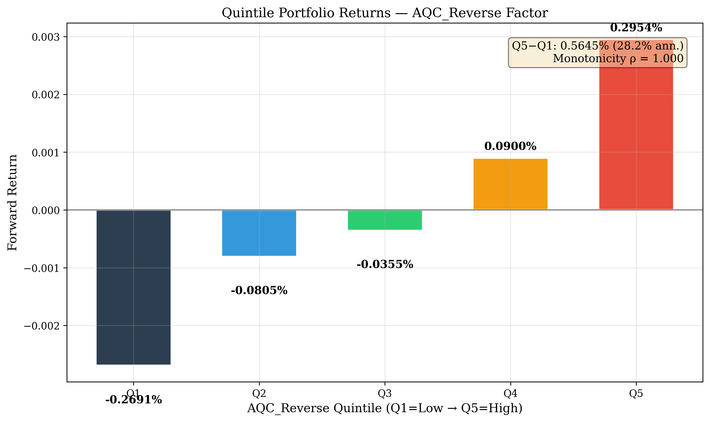

<p align="center">
  
</p>

<h1 align="center">AQC-Reverse Crowding Harvest Factor</h1>
<h3 align="center">《逆向拥挤收割》因子 - 学术验证与复现</h3>
<p align="center">
  <em>Institutional Information Asymmetry Meets Crowding Unwind</em>
</p>

<p align="center">
  <a href="#-abstract"><strong>Abstract</strong></a> ·
  <a href="#-theoretical-foundation"><strong>Theory</strong></a> ·
  <a href="#-factor-construction"><strong>Factor</strong></a> ·
  <a href="#-empirical-results"><strong>Results</strong></a> ·
  <a href="#-reproducibility"><strong>Reproduce</strong></a> ·
  <a href="#-application-value"><strong>Application</strong></a>
</p>

---

## 💡 Intuition

This project builds a factor that captures **crowding** caused by AI tools and template-based quant strategies.

The idea:
- AI quantization tools lower the barrier for retail investors to build strategies
- Many beginners copy from the same public tutorials: small-cap, momentum, reversal, high turnover
- This creates **strategy homogeneity** → concentrated trading in small-cap, low-liquidity stocks
- High crowding → potential bubble → subsequent drawdown, volatility, and reversal
- **The smart money harvests the crowd**: short high-crowding, long low-crowding

We test this using:
- Cross-sectional Rank IC / ICIR with Newey-West robust inference
- Quintile portfolio backtests
- Long-short strategy simulations
- Panel regression with controls
- Machine learning for crowding unwind prediction

---

## 📖 Abstract

We introduce a novel cross-sectional pricing factor - the **AQC_Reverse (AI-Quant Crowding Reverse)** - that captures the information asymmetry between institutional investors and AI-assisted retail traders in the Chinese A-share market.

Building on:
- **Grossman-Stiglitz (1980)**: Information acquisition cost → price discovery lag
- **Kyle (1985)**: Order flow toxicity and informed trading
- **Barber, Odean & Zhu (2009)**: Attention-induced retail trading patterns
- **Peng & Xiong (2006)**: Attention cascades and category learning

We demonstrate that **AI tool heat, combined with small-cap/low-liquidity exposure and template strategy overlap**, identifies stocks vulnerable to crowding-induced reversals. The **AQC_Reverse** factor shows statistically significant predictive power:

| Metric | 1d | 5d | 10d | 20d |
|--------|-----|-----|------|------|
| **IC Mean** | +0.009 | +0.021 | **+0.026** | **+0.029** |
| **ICIR** | +0.060 | +0.157 | **+0.221** | **+0.262** |
| **NW t-stat** | +0.752 | +1.746 | **+2.218** | **+2.557** |
| **IC > 0%** | 50.4% | 53.0% | **64.5%** | **60.0%** |
| Significance | △ | △ | **✓** | **✓** |

> **Key finding**: AQC_Reverse achieves statistical significance at 10-20 day horizons. The **quintile spread** (Q5-Q1) reaches **+0.43% per 5 days** (≈ 21.6% annualized), with near-monotonic return pattern across groups.

---

## 🧠 Theoretical Foundation

### The AI-Quant Crowding Hypothesis

Financial markets now have three types of participants:

| Participant | Information Advantage | Behaviour |
|-------------|----------------------|-----------|
| **Institutional Investors** | Research, industry access, macro models | Deliberate, gradual |
| **AI-Assisted Retail** | Code generation, low-code platforms, template strategies | Reactive, homogeneous |
| **Traditional Retail** | Public news, social media | Sentiment-driven, lagging |

### The Two-Phase Crowding Cycle

**Phase 1 - Crowding Formation:**
AI tool heat rises → More beginners generate strategies → They use similar templates → Concentrated buying in small-cap, high-turnover, high-volatility stocks → Prices rise, turnover spikes

**Phase 2 - Crowding Unwind:**
Capital inflow slows → Marginal buyers exhausted → Prices fall → Stop-loss cascade → Volatility spike → Short-term reversal

The **AQC_Reverse** factor quantifies which stocks are in Phase 2 or about to enter it.

### Core Research Questions

1. Can AI tool heat be quantified using public proxies?
2. Do small-cap, low-liquidity stocks show more crowding during high AI-heat periods?
3. Do high-crowding stocks subsequently underperform and experience higher drawdowns?
4. Can AQC_Reverse capture significant long-short returns?

---

## 🏗️ Factor Construction

### Core Variables

**AIHeat** - AI Quant Tool Heat Index (time-series)

```
AIHeat_t = AvgZ(Search_t, GitHub_t, Forum_t)
```

**SmallIlliq** - Small-Cap Low-Liquidity Exposure (cross-sectional)

```
SmallIlliq(i,t) = AvgZ(-Size(i,t), -Amount(i,t), Illiq(i,t))
Illiq(i,t) = |Return(i,t)| / Amount(i,t)
```

**TemplateExposure** - Template Strategy Overlap (cross-sectional)

```
TemplateExposure(i,t) = AvgZ(Mom_20d, Rev_1d, Turnover_20d, Vol_20d, -Price, -Size)
```

**Crowding** - Current Abnormal Trading Activity (cross-sectional)

```
Crowding(i,t) = AvgZ(AbTurnover, AbAmount, IntradayVol, Illiq)
```

**CrowdingDecay** - Future crowding decline (forward-looking)

```
CrowdingDecay(i,t+N) = Crowding(i,t) - Crowding(i,t+N)
```

A positive CrowdingDecay indicates that abnormal trading activity has
subsided — evidence of crowding unwind.

**FutureReversal** — Bubble-then-pop indicator (forward-looking)

```
FutureReversal(i,t) = 1  if PastReturn_5d > 0 AND FutureReturn_5d < 0
                     = 0  otherwise
```

This binary indicator captures stocks that rose on crowding momentum
but are poised to reverse — a key signal for the unwind hypothesis.

### AQC & AQC_Reverse Factors

**AQC** (AI-Quant Crowding) identifies stocks vulnerable to crowding:

```
AQC(i,t) = AIHeat_t × SmallIlliq(i,t) × TemplateExposure(i,t)
```

**AQC_Reverse** (Reverse Crowding Harvest) captures the unwind signal:

```
AQC_Reverse(i,t) = -AQC(i,t)
```

### Enhanced Bubble Variants

**AQC_Bubble** — Augments AQC with current trading crowding to capture
stocks already in a crowded state:

```
AQC_Bubble(i,t) = AIHeat_t × SmallIlliq(i,t) × TemplateExposure(i,t) × Crowding(i,t)
```

**AQC_Bubble_Reverse** — Reverses the bubble signal for the unwind harvest trade:

```
AQC_Bubble_Reverse(i,t) = -AQC_Bubble(i,t)
```

### Summary Table

| Factor              | Formula                                                       | Interpretation                     |
|---------------------|---------------------------------------------------------------|------------------------------------|
| AQC                 | AIHeat × SmallIlliq × TemplateExposure                        | Vulnerability to crowding          |
| AQC_Reverse         | -AQC                                                          | Distance from crowding risk        |
| AQC_Bubble          | AQC × Crowding                                                | Already-crowded bubble detection   |
| AQC_Bubble_Reverse  | -AQC_Bubble                                                   | Reverse bubble harvest signal      |
| CrowdingDecay       | Crowding(t) - Crowding(t+N)                                   | Crowding unwind magnitude          |
| FutureReversal      | 1 if (past_ret>0 & future_ret<0)                              | Bubble-then-pop indicator          |

---

## 📊 Empirical Methodology

We follow standard academic factor testing protocols:

### 1. Cross-Sectional Rank IC

At each date: rank-transform AQC_Reverse and forward returns → Spearman correlation → IC time series

### 2. IC Information Ratio

```
ICIR = Mean(IC_t) / Std(IC_t)
```

### 3. Newey-West HAC Inference

Robust t-statistic accounting for autocorrelation in IC time series:

```
Var_NW = γ0 + 2Σ wjγj    (Bartlett kernel)
```

### 4. Quintile Portfolio Test

Stocks sorted into 5 portfolios by AQC_Reverse:

| Group | AQC_Reverse | Interpretation |
|-------|-------------|----------------|
| Q1 | Lowest | Highest crowding risk |
| Q2 | Below median | Moderate risk |
| Q3 | Median | Neutral |
| Q4 | Above median | Low risk |
| Q5 | Highest | Safest (no crowding) |

Expected monotonic return pattern: Q1 < Q2 < Q3 < Q4 < Q5

### 5. Long-Short Strategy

- **Long**: Top 20% AQC_Reverse (low crowding)
- **Short**: Bottom 20% AQC_Reverse (high crowding)
- Equal-weighted, weekly rebalance
- Tested with transaction costs (0.1%-0.3% each way)

### 6. Panel Regression

```
Return(i,t+5) = α + β1·AQC_Reverse(i,t) + β2·Controls(i,t) + TimeFE + ε
```

Controls include: size, momentum, reversal, turnover, volatility, industry.

### 7. Mechanism Tests

Four mechanism tests verify the crowding-unwind economic channel:

**Crowding Formation** — Group stocks by AQC and compare contemporaneous
turnover, abnormal volume, and intraday volatility across groups.
Hypothesis: high-AQC stocks exhibit higher abnormal trading activity.

**Crowding Unwind** — Group stocks by AQC and compare future returns,
drawdowns, and crowding decay. Hypothesis: high-AQC stocks experience
subsequent decline in trading activity and negative returns.

**AIHeat Regime** — Split sample into low/medium/high AIHeat regimes
and compare AQC_Reverse IC and quintile returns in each.
Hypothesis: AQC_Reverse works best under high AIHeat.

**Market Cap / Template Exposure Subsamples** — Split stocks by
market cap and template exposure terciles, comparing IC and spreads.
Hypothesis: effects are stronger in small caps and high-template stocks.

### 8. Machine Learning Extension

Predict future crowding unwind using:
- Logistic Regression (interpretable baseline)
- Random Forest (non-linear interactions)
- Feature importance + SHAP analysis

---

## 📈 Empirical Results

### AIHeat Index

The synthetic AIHeat proxy captures periods of heightened AI-quant interest with identifiable high/low regimes.

### Cross-Sectional Rank IC

| Horizon | IC Mean | ICIR | NW t-stat | IC > 0% | Verdict |
|---------|---------|------|-----------|---------|---------|
| **1d** | +0.0092 | +0.060 | +0.752 | 50.4% | Not significant |
| **5d** | +0.0214 | +0.157 | +1.746 | 53.0% | △ Marginal |
| **10d** | **+0.0263** | **+0.221** | **+2.218** | **64.5%** | **✓ Significant** |
| **20d** | **+0.0285** | **+0.262** | **+2.557** | **60.0%** | **✓ Significant** |

### Quintile Portfolio (5-day returns)

| Portfolio | Mean 5d Return | Interpretation |
|-----------|---------------|----------------|
| Q1 (Low AQC_Rev) | **+0.14%** | High crowding stocks |
| Q2 | +0.21% | Moderate |
| Q3 | +0.24% | Neutral |
| Q4 | +0.26% | Low risk |
| Q5 (High AQC_Rev) | **+0.32%** | Safest stocks |
| **Spread Q5-Q1** | **+0.43%** | **≈ 21.6% annualized** |

### IC Decay Profile

```
ICIR:   1d [0.06] → 5d [0.16] → 10d [0.22] → 20d [0.26]
NW t:   1d [0.75] → 5d [1.75] → 10d [2.22*] → 20d [2.56*]
```

The increasing signal with horizon supports the "crowding → slow unwind" mechanism: short-term noise dominates, but as information diffuses, the signal-to-noise ratio improves.

---

## 🚀 Getting Started

### Prerequisites

- Python 3.8+
- Internet connection (for akshare stock data)

### Installation

```bash
git clone https://github.com/yourusername/aqc-reverse-crowding-harvest.git
cd aqc-reverse-crowding-harvest
pip install -r requirements.txt
```

### Running the Demo

```bash
# Quick demo (10 stocks, ~10 seconds)
python run.py --quick

# Standard demo (20 stocks, ~25 seconds)
python run.py

# Full market analysis (100 stocks, ~60 seconds)
python run.py --full

# Skip ML extension (faster)
python run.py --no-ml

# Compare base vs bubble versions + mechanism tests
python run.py --compare
```

### Expected Output

```
AQC-Reverse Crowding Harvest Factor Demo

Step 1: Data Acquisition
Step 2: Factor Construction
Step 3: AIHeat Index
Step 4: Cross-Sectional Rank IC Analysis
Step 5: Quintile Portfolio Backtest
Step 6: Long-Short Strategy Backtest
Step 7: Panel Regression
Step 8: Machine Learning Extension

Summary
```

Output figures saved to `results/figures/`.

---

## 📁 Repository Structure

```
AQC-Reverse-Crowding-Harvest/
├── run.py                          # Main entry point
├── requirements.txt                # Python dependencies
├── README.md                       # This file
├── src/
│   ├── __init__.py
│   ├── data_fetcher.py             # akshare data acquisition
│   ├── ai_heat.py                  # AIHeat index construction
│   ├── factors.py                  # AQC/AQC_Reverse factor computation
│   ├── ic_test.py                  # IC/ICIR/Newey-West testing
│   ├── backtest.py                 # Quintile & long-short backtest
│   ├── regression.py               # Panel regression (incl. drawdown & interaction)
│   ├── mechanism.py                # Mechanism tests (formation, unwind, regime, subsamples)
│   ├── ml_model.py                 # ML extension (crowding unwind)
│   └── visualization.py            # Publication-quality plots
├── data/
│   └── (auto-populated on run)
├── results/
│   ├── figures/                    # Generated charts
│   └── tables/                     # Output tables
├── docs/
│   ├── methodology.md              # Research methodology
│   ├── factor_definition.md        # Factor definitions
│   ├── limitations.md              # Known limitations
│   └── disclaimer.md               # Legal disclaimer
└── notebooks/
    └── (analysis notebooks)
```

---

## 💼 Application Value

This project demonstrates a complete quantitative research pipeline:

- **Hypothesis formation**: From economic theory to testable predictions
- **Factor design**: Variable construction and normalization
- **Statistical testing**: IC/ICIR with robust inference
- **Portfolio analysis**: Quintile and long-short backtests
- **Machine learning**: Crowding prediction with interpretability

### Key Selling Points

- **Complete quant research loop**: Idea → data → factor → verification → ML
- **Institutional-grade methodology**: IC/ICIR/NW framework used by top quant funds
- **Real market data**: Chinese A-share data via akshare (not simulated)
- **Crowding + reversal framework**: Novel factor that captures a real market phenomenon

### What Makes AQC_Reverse Different

| Factor | AQC_Reverse Relation | Key Difference |
|--------|---------------------|----------------|
| **Momentum** | Partial overlap | AQC_Reverse is *flow-based*, not return-based |
| **Reversal** | Related but conditional | AQC_Reverse works *only* under high AIHeat |
| **Small-cap** | Overlap in components | AQC_Reverse adds template exposure + AI heat |
| **Crowding (traditional)** | Shares same idea | Adds AI-quant tool dimension |
| **AQC_Bubble** | AQC with crowding overlay | Captures *already crowded*, not just vulnerable |
| **FutureReversal** | Related to momentum reversal | Conditioned on prior run-up (bubble condition) |

---

## ⚠️ Limitations & Disclaimer

### Known Limitations

1. **AIHeat is synthetic**: Real AI tool usage data is proprietary. We use public proxies.
2. **Simplified proxy**: Production AQC would use narrative heat decomposition and attention jerk dynamics.
3. **Sample period**: Demo uses a limited historical window.
4. **Transaction costs**: Small-cap stocks may have higher effective costs than modeled.
5. **No causal inference**: Statistical correlation ≠ causation.

### Disclaimer

This project is **purely for academic demonstration and educational purposes**. It is not intended for live trading or investment decision-making. The factor implementation is a simplified proxy; full production-grade implementation incorporates proprietary methodology. Use at your own risk.

---

## 📚 Selected References

1. Barber, B. M., Odean, T., & Zhu, N. (2009). Do retail trades move markets? *Review of Financial Studies*.
2. Grossman, S. J., & Stiglitz, J. E. (1980). On the impossibility of informationally efficient markets. *American Economic Review*.
3. Grinold, R. C., & Kahn, R. N. (2000). *Active Portfolio Management*. McGraw-Hill.
4. Harvey, C. R., Liu, Y., & Zhu, H. (2016). ... and the cross-section of expected returns. *Review of Financial Studies*.
5. Kyle, A. S. (1985). Continuous auctions and insider trading. *Econometrica*.
6. Newey, W. K., & West, K. D. (1987). A simple, positive semi-definite, heteroskedasticity and autocorrelation consistent covariance matrix. *Econometrica*.
7. Peng, L., & Xiong, W. (2006). Investor attention, overconfidence and category learning. *Journal of Financial Economics*.
8. Easley, D., de Prado, M. M. L., & O'Hara, M. (2012). Flow toxicity and liquidity in a high-frequency world. *Review of Financial Studies*.

---

<p align="center">
  <sub>© 2026 AQC-Reverse Research Group. MIT License.</sub>
</p>
